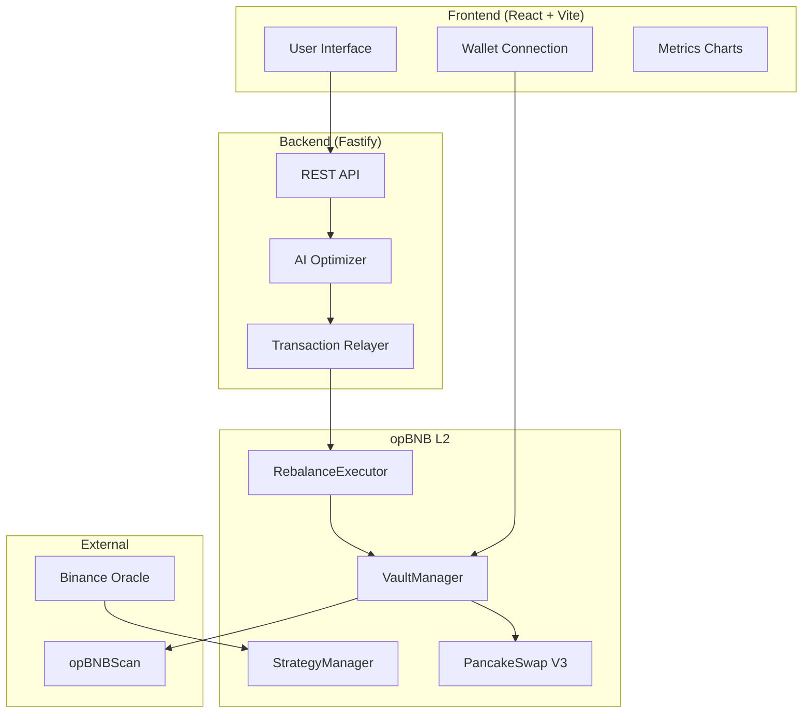

# Adaptive Liquidity Orchestrator

**AI-Driven DEX Liquidity Manager on opBNB**

[](https://opensource.org/licenses/MIT)
[](https://www.bnbchain.org/)
[](https://opbnb.bnbchain.org/)

> **Reduce slippage and impermanent loss with intelligent liquidity rebalancing. The first AI-driven DEX liquidity orchestrator on opBNB.**


## Tech Stack

### Frontend


### Web3 & Auth


-3B99FC?style=for-the-badge&logo=walletconnect&logoColor=white)

### Blockchain


### Backend


---

## Problem Statement

DeFi liquidity providers face significant challenges:
- **Impermanent Loss (IL)**: Up to 40% loss in volatile markets.
- **Manual Position Management**: Hours spent monitoring and adjusting ranges.
- **High Slippage**: Large trades on thin pools incur heavy slippage.
- **Static LP Positions**: Most LPs use V2-style pools without optimization.

## Solution

**Adaptive Liquidity Orchestrator** uses AI-driven algorithms to automatically manage LP positions:
1. **Real-time Volatility Monitoring**: Tracks market conditions using simple-statistics and on-chain data.
2. **Intelligent Rebalancing**: Automatically adjusts liquidity ranges based on AI recommendations.
3. **Slippage Reduction**: Optimizes depth across price ranges.
4. **IL Protection**: Shifts liquidity to stable pools during volatility spikes.

---

## Architecture



---

## Quick Start

### Prerequisites
- Node.js 20+
- npm or yarn
- MetaMask wallet (opBNB Testnet)

### Installation

```bash
# Clone the repository
git clone https://github.com/0xsupremedev/adaptive-liquidity-orchestrator.git
cd adaptive-liquidity-orchestrator

# Install dependencies (Root, Backend, Frontend)
npm run install:all # (Hypothetical script, or run manually)
```

### Environment Setup

Create a `.env` file in the root:
```env
PRIVATE_KEY=your_private_key
OPBNBSCAN_API_KEY=your_api_key
VITE_THIRDWEB_CLIENT_ID=your_thirdweb_client_id
```

### Run Locally

1. **Smart Contracts Node**:
   ```bash
   npm run node
   npm run deploy:local
   ```

2. **Backend**:
   ```bash
   cd backend
   npm run dev
   ```

3. **Frontend**:
   ```bash
   cd frontend
   npm run dev
   ```

---

## AI Strategy Overview

The optimizer uses **volatility-based heuristics**:

1. **Volatility Detection**: Calculates Exponential Moving Average (EMA) of price changes.
2. **Threshold Comparison**: Recommendations trigger if volatility > 5%.
3. **Action Selection**:
   - **High Volatility**: Widen range + move to stable pool.
   - **Trending Up**: Shift range upwards.
   - **Trending Down**: Shift range downwards.

---

## BNB Hackathon 2025

Built for the **BNB Chain Hackathon 2025**.

- **Innovation**: First AI-driven LP manager on opBNB.
- **Integration**: Native opBNB L2 deployment, Thirdweb Auth, RainbowKit.
- **User Experience**: Premium "Minimal Animated Hero" UI.

---

## License


This project is licensed under the MIT License - see the [LICENSE](LICENSE) file for details.
